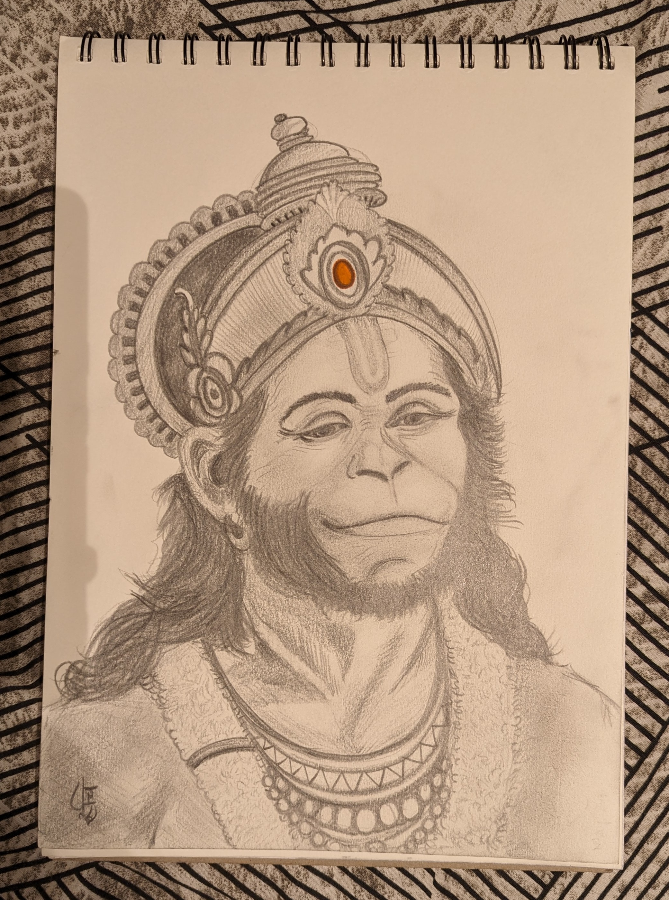

Painting has felt like meditation to me - whenever my brain feels cloudy or I cannot seem to hold my pain I find myself seeking refuge in the art. I am not an original artist - I take inspiration from the internet, but that doesn't make the paintings/art expressionless. 

This doesn't mean I only paint when I am feeling sad, but that most of the times I am painting - I am getting answers to the questions I didn't know I was asking.

[June 2024] Ganesha (yet again)

[May 2024] Hanuman 

Back to basics - sketching with a pencil. 

For quite some time, I enjoyed the process of pencil sketching - mostly because of its accessibility. It doesn't require me to spread those color tubes, bring out any brushes and find a rough cloth or a palette. Just one pencil and a piece of paper, that's all it takes. 

[March 2024] Krishna - This is the longest I have ever took to finish any painting. 

Like you cannot put the extra color that you squeezed out of the tube on the canvas just cause you don't want to waste the paint, you cannot cry about the hard work/ effort that's going to "waste" cause you didn't see any direct results. it is about the painting you are creating and not what you had to put in. work with whatever you have. 

Ganesha

Meera 

Goku 
